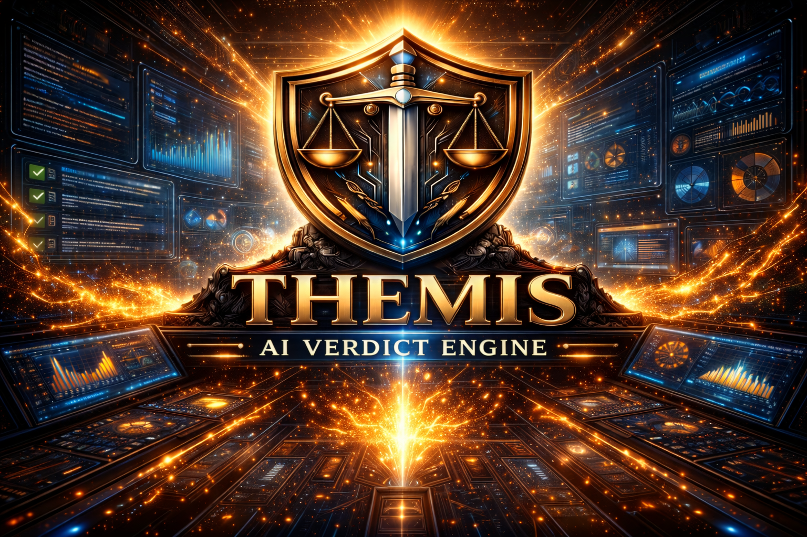

# Themis

<p align="center">
  
  <a href="https://github.com/vitron-ai/themis/actions/workflows/ci.yml">
    
  </a>
</p>

**A unit test framework built for AI coding agents.**

Drop-in alternative to Jest and Vitest. Agents write tests, get structured failure output, and self-repair — all in the same edit-test-fix loop.

- **Faster** — 68.59% faster than Vitest, 130.26% faster than Jest on the same benchmark ([proof](#performance))
- **Agent-native** — `--agent` JSON with failure clusters and structured repair hints
- **One-command migration** — `npx themis migrate jest` or `vitest` with codemods
- **Modern by default** — `.ts`, `.tsx`, `.js`, `.jsx`, ESM, React Testing Library, no config gymnastics
- **Discoverable** — ships `AGENTS.md`, `themis.ai.json`, and a [Tessl tile](tessl/tile.json) so agents find and adopt it automatically

---

## Quickstart

```bash
npm install -D @vitronai/themis@latest
npx themis init --agents
npx themis generate src     # or `app` for Next App Router repos
npx themis test
```

`init --agents` writes config, updates `.gitignore`, and scaffolds a downstream `AGENTS.md`.

**Using Claude Code?** Run `npx themis init --claude-code` to install `CLAUDE.md`, a Claude Code skill, and slash commands (`/themis-test`, `/themis-generate`, `/themis-migrate`, `/themis-fix`).

---

## Performance

On the same React showcase benchmark, Themis measured **68.59% faster than Vitest** and **130.26% faster than Jest** on median wall-clock time. The comparison artifact is emitted by CI as `.themis/benchmarks/showcase-comparison/perf-summary.json`.

The first-try benchmark measures how often an AI agent generates tests that pass on the first run — the metric that matters most for agent-driven development:

```bash
ANTHROPIC_API_KEY=sk-... npm run benchmark:first-try
```

---

## How it works

### Plain English → structured tests

```js
intent('user can sign in', ({ context, run, verify, cleanup }) => {
  context('a valid user', (ctx) => {
    ctx.user = { email: 'a@b.com', password: 'pw' };
  });

  run('the user submits credentials', (ctx) => {
    ctx.result = { ok: true };
  });

  verify('authentication succeeds', (ctx) => {
    expect(ctx.result.ok).toBe(true);
  });

  cleanup('remove test state', (ctx) => {
    delete ctx.user;
  });
});
```

Phase names: `context`, `run`, `verify`, `cleanup`. Legacy aliases (`arrange/act/assert`, `given/when/then`) also supported.

### Mocks and UI primitives

```js
mock('../src/api', () => ({
  fetchUser: fn(() => ({ id: 'u_1', name: 'Ada' }))
}));

const { fetchUser } = require('../src/api');

test('mock captures calls', () => {
  const user = fetchUser();
  expect(fetchUser).toHaveBeenCalledTimes(1);
  expect(user).toMatchObject({ id: 'u_1', name: 'Ada' });
});
```

For `jsdom` tests, Themis ships `render`, `screen`, `fireEvent`, `waitFor`, `useFakeTimers`, `mockFetch`, and more. Full list in the [API reference](docs/api.md).

### Code generation

Themis scans your source tree and generates contract tests for exported modules, React components, hooks, Next.js routes, and services:

```bash
npx themis generate src
npx themis test
```

When generated tests fail:

```bash
npx themis test --fix
```

`--fix` regenerates affected targets and reruns the suite. See the [API reference](docs/api.md) for all generation flags (`--review`, `--plan`, `--write-hints`, `--strict`, `--changed`, etc.).

### Migration

```bash
npx themis migrate jest
npx themis migrate vitest
npx themis test
```

One command scaffolds a compatibility bridge. Add `--rewrite-imports` to rewrite import paths, `--convert` for codemods. See the [migration guide](docs/migration.md).

---

## Config

`themis.config.json`:

```json
{
  "testDir": "tests",
  "generatedTestsDir": "__themis__/tests",
  "testRegex": "\\.(test|spec)\\.(js|jsx|ts|tsx)$",
  "maxWorkers": 7,
  "reporter": "next",
  "environment": "node",
  "setupFiles": ["tests/setup.ts"],
  "tsconfigPath": "tsconfig.json"
}
```

Use `environment: "jsdom"` for DOM-driven tests. Themis auto-stubs common style/asset imports (`.css`, `.scss`, `.png`, `.svg`, etc.).

---

## TypeScript

```json
{
  "compilerOptions": {
    "types": ["@vitronai/themis/globals"]
  }
}
```

Ships first-party typings for all test APIs, typed intent context, and project-aware module loading for `.ts`, `.tsx`, ESM `.js`, `.jsx`, and `tsconfig` path aliases.

---

## Pair with Alethia

Themis owns the unit/contract layer. [Alethia](https://github.com/vitron-ai/alethia) owns the E2E/policy layer. Together they form the tightest test loop an autonomous coding agent can sit inside:

1. Agent generates code
2. **Themis** verifies the contract in milliseconds
3. **Alethia** verifies the running app in a real browser, under safety policy, with a signed audit trail

Use Themis on its own — it's MIT and stands alone.

---

## Reference docs

- [API reference](docs/api.md) — all CLI flags, globals, matchers, mocks, UI primitives
- [Agent adoption guide](docs/agents-adoption.md) — downstream repo setup
- [Migration guide](docs/migration.md) — Jest/Vitest migration details
- [Why Themis](docs/why-themis.md) — positioning and differentiators
- [Showcase comparisons](docs/showcases.md) — direct Jest/Vitest examples
- [Tutorial: Testing with Claude Code](docs/tutorial-claude-code.md)
- [VS Code extension](docs/vscode-extension.md)
- [Release policy](docs/release-policy.md)
- [Publish guide](docs/publish.md)
- [Changelog](CHANGELOG.md)

<p align="center">
  
</p>
